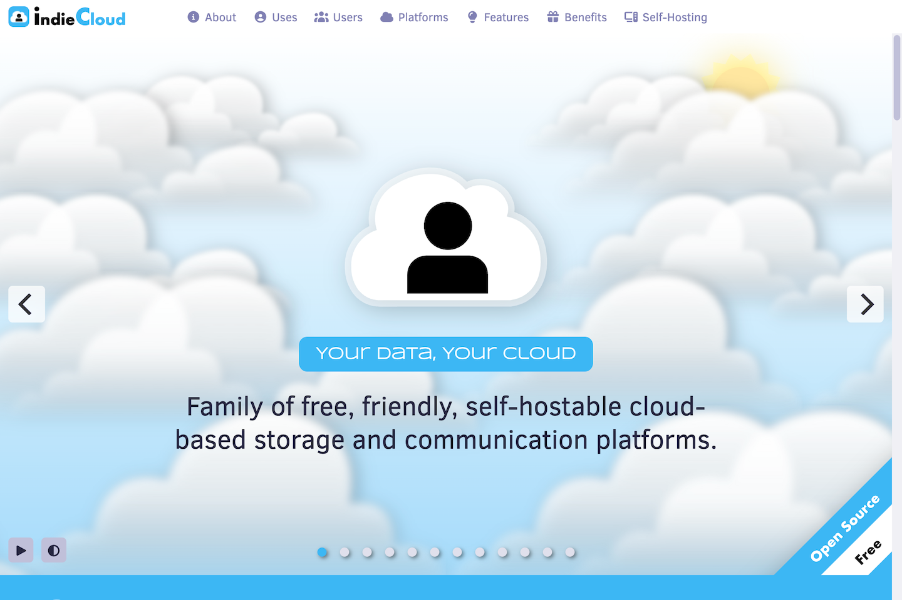

	

# IndieCloud

IndieCloud is a complete family of self-hostable cloud-based data management and sharing platforms, each of which has been optimized for a particular application.

IndieCloud can help you to upload, manage, view, and share your collection of files, code, music, and data.

- Free
- Self-hostable
- Easy to use and install
- Platform independent
- Secure

Welcome Screen

## Which IndieCloud Is Right For You?

- If you would like to manage and share files and messages, use [IndieData](https://github.com/IndieSource/IndieData).
- If you are a photographer and want to manage and share your photos, use [IndiePhotos](https://github.com/IndieSource/IndiePhotos).
- If you mainly want to communicate with friends, family or colleagues, use [IndieChats](https://github.com/IndieSource/IndieChats).
- If you need to manage geolocated data, like aerial drone photos, use [IndieMaps](https://github.com/IndieSource/IndieMaps).
- If you want to manage and play music, podcasts, or audio, use [IndieAudio](https://github.com/IndieSource/IndieAudio).
- If you are a software developer and want to manage your source code, use [IndieCoder](https://github.com/IndieSource/IndieCoder).
- If you want to manage and play videos, use [IndieVideo](https://github.com/IndieSource/IndieVideo).
- If you just want to manage your files and don't need the ability to exchange messages, use [IndieFiles](https://github.com/IndieSource/IndieFiles).
- If you want to experiment with AI generated images, use [IndieDreams](https://github.com/IndieSource/IndieDreams).
- If you want to access data in S3 buckets, use [IndieBuckets](https://github.com/IndieSource/IndieBuckets).

 

	<a href="https://github.com/IndieSource/IndieChats">
		
		<b>IndieChats</b>
	</a>
	
IndieChats enables you to chat by discussion topic or by direct message so you can keep in touch with your friends, family, or colleagues. Exchange messages, news, files, documents, folders, images, code, music, and more.

	<a href="https://github.com/IndieSource/IndieMaps">
		
		<b>IndieMaps</b>
	</a>
	
IndieMaps is a cloud-based geospatial image and data storage, management, and sharing system. Best of all, you can run it on your own server.

	<a href="https://github.com/IndieSource/IndieData">
		
		<b>IndieData</b>
	</a>
	
IndieData is a cloud-based file storage, management, and sharing system. IndieData makes sharing your data simple. Best of all, you can run it on your own server.

	<a href="https://github.com/IndieSource/IndiePhotos">
		
		<b>IndiePhotos</b>
	</a>
	
IndiePhotos is a cloud-based photo management and sharing system that makes organizing and sharing your photos easy. Best of all, you can run on your own server!

	<a href="https://github.com/IndieSource/IndieCoder">
		
		<b>IndieCoder</b>
	</a>
	
IndieCoder is a cloud-based code storage, management, and sharing system. Best of all, you can run it on your own server!

	<a href="https://github.com/IndieSource/IndieFiles">
		
		<b>IndieFiles</b>
	</a>
	
IndieFiles is a cloud-based file storage, management, and sharing system. IndieFiles makes file sharing easy. Best of all, you can run it on your own server.

	<a href="https://github.com/IndieSource/IndieBuckets">
		
		<b>IndieBuckets</b>
	</a>
	
IndieBuckets is a cloud-based web interface for managing S3 data. It combines the capacity of S3 with the familiar look and feel of your desktop or mobile OS. Best of all, you can run it on your own server.

	<a href="https://github.com/IndieSource/IndieVideo">
		
		<b>IndieVideo</b>
	</a>
	
IndieVideo is a cloud-based video storage, management, and sharing system. You love your videos. Now you can love your video platform. Best of all, you can run it on your own server.

	<a href="https://github.com/IndieSource/IndieDreams">
		
		<b>IndieDreams</b>
	</a>
	
IndieDreams is a cloud-based AI image generation platform. Using simple text prompts, you can visualize and share virtually anything that you can dream of.

	<a href="https://github.com/IndieSource/IndieAudio">
		
		<b>IndieAudio</b>
	</a>
	
IndieAudio is a cloud-based audio storage, management, and sharing system. You love your music. Now you can love your music platform. Best of all, you can run it on your own server.

## License

Distributed under the <a href="https://en.wikipedia.org/wiki/MIT_License">MIT License</a> which allows unrestricted use of the software. See [LICENSE](LICENSE) for more information.

## Contact

mailto:info@indiecloud.org
